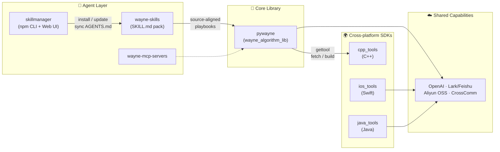

<div align="center">
  
</div>

<div align="center">
  
</div>

<div align="center">
  <a href="https://wayne-algorithm-lib.readthedocs.io/">
    
  </a>
  <a href="http://wangye.xin">
    
  </a>
  <a href="http://cvllm.com">
    
  </a>
  <a href="mailto:wang121ye@hotmail.com">
    
  </a>
</div>

<div align="center">
  <a href="http://leetcode.com/wangyehope">
    
  </a>
  <a href="https://pypi.org/project/pywayne/">
    
  </a>
  <a href="https://www.npmjs.com/package/@wang121ye/skillmanager">
    
  </a>
  
</div>

<br/>

## 🧭 About Me

> **maths lover** · 清华大学 · 算法工程师(XR / 智能穿戴方向)

我在 AR 眼镜与可穿戴设备行业做算法:**SLAM/VIO、多传感器标定、姿态估计、微手势识别、语音唤醒、信号处理**。
我的信条是——算法不该停留在 demo 里,所以我持续把原型沉淀为 **可复用的库、CLI、跨语言 SDK 和 AI Agent 工具链**。

I build algorithms for AR glasses & wearables — and the toolchains that ship them. From Kalman filters to Claude skills, from IMU streams to `pip install`.

<table>
  <tr>
    <td>🕶️</td>
    <td><b>XR & Robotics</b></td>
    <td>SLAM / VIO · camera-IMU & hand-eye calibration · SE(3)/SO(3) · AHRS</td>
  </tr>
  <tr>
    <td>⌚</td>
    <td><b>Wearable Sensing</b></td>
    <td>micro hand-gesture recognition · IMU/PPG pipelines · keyword spotting (KWS)</td>
  </tr>
  <tr>
    <td>📈</td>
    <td><b>Signal Processing</b></td>
    <td>filtering · baseline removal · peak detection · time-series ML</td>
  </tr>
  <tr>
    <td>🤖</td>
    <td><b>AI Agent Engineering</b></td>
    <td>Claude skills · MCP servers · Lark/Feishu bots · reproducible agent workflows</td>
  </tr>
  <tr>
    <td>🧰</td>
    <td><b>Developer Tooling</b></td>
    <td>Python/C++/Swift/Java cross-platform SDKs · packaging · docs · automation</td>
  </tr>
</table>

## 🛠️ Tech Stack

<div align="center">

**Languages**


**Domains & Frameworks**


**AI & Agents**


</div>

## 🚀 Featured Projects

### 🧰 Toolchain · Cross-platform SDKs

| Project | Description | |
| --- | --- | --- |
| **[wayne_algorithm_lib](https://github.com/wangyendt/wayne_algorithm_lib)** (`pywayne`) | Python & C++ 算法百宝箱:DSP、CV/robotics、自动化与平台集成 · [📖 Docs](https://wayne-algorithm-lib.readthedocs.io/) · `pip install pywayne` |  |
| **[cpp_tools](https://github.com/wangyendt/cpp_tools)** | C++ 第三方库/工具的一键拉取与构建(`gettool` 后端) |  |
| **[ios_tools](https://github.com/wangyendt/ios_tools)** | Swift Package:OpenAI、Lark、Aliyun OSS、CrossComm(iOS/macOS/watchOS/tvOS) |  |
| **[java_tools](https://github.com/wangyendt/java_tools)** | 同一套平台集成能力的 Java 实现(Maven 多模块) |  |

### 🤖 AI Agent Engineering

| Project | Description | |
| --- | --- | --- |
| **[skillmanager](https://github.com/wangyendt/skillmanager)** | 跨平台 Agent Skills 管理器:官方/三方/自研源统一安装更新,带 Web UI · `npm i -g @wang121ye/skillmanager` |  |
| **[wayne-skills](https://github.com/wangyendt/wayne-skills)** | Source-aligned 的 `SKILL.md` 工作流集:skill 路径与源码模块一一对应 |  |
| **[wayne-mcp-servers](https://github.com/wangyendt/wayne-mcp-servers)** | 自研 MCP (Model Context Protocol) servers |  |
| **[lark-feishu-codex-listener](https://github.com/wangyendt/lark-feishu-codex-listener)** | 监听飞书群聊,用 Codex SDK 自动回复的 Agent Bot |  |

### 🕶️ XR · Robotics · Sensor Fusion

| Project | Description | |
| --- | --- | --- |
| **[kalibr-camimu-ceres](https://github.com/wangyendt/kalibr-camimu-ceres)** | 用 Ceres Solver 重写的 Kalibr 对齐 camera-IMU 标定库 |  |
| **[Coordinate-Transformation-Helper](https://github.com/wangyendt/Coordinate-Transformation-Helper)** | 坐标系与旋转表示转换 GUI(欧拉角/四元数/旋转矩阵) |  |
| **[SlamPoseVisualizer](https://github.com/wangyendt/SlamPoseVisualizer)** | 通过 adb 流实时可视化 SLAM 位姿 |  |
| **[3dof_viewer](https://github.com/wangyendt/3dof_viewer)** | Apple API vs VQF 的 3DoF 姿态对比工具 |  |
| **[MicroHandGestureCollectorWatchOS](https://github.com/wangyendt/MicroHandGestureCollectorWatchOS)** | Apple Watch 100Hz IMU 采集,用于微手势识别 |  |

### 📈 Signal Processing · ML

| Project | Description | |
| --- | --- | --- |
| **[BaselineRemoval](https://github.com/wangyendt/BaselineRemoval)** | 信号基线漂移去除算法 |  |
| **[track_signal_in_rawdata_stream](https://github.com/wangyendt/track_signal_in_rawdata_stream)** | 触控面板 rawdata 流中的力信号追踪 |  |
| **[Heart-Rate-Detector-using-1D_CNN](https://github.com/wangyendt/Heart-Rate-Detector-using-1D_CNN)** | 1D CNN 数据流心率检测 |  |
| **[guess_words](https://github.com/wangyendt/guess_words)** | 语义猜词游戏:embedding 余弦 + 全库排名,FastAPI + uni-app |  |

## 🧩 Ecosystem — How the Pieces Fit

一套算法能力,四种语言生态,一个 Agent 入口:



<details>
<summary><b>⚡ Quick Start(点开看常用命令)</b></summary>

### pywayne — Python 算法库

```bash
pip install -U pywayne
python -c "import pywayne; print('pywayne OK')"
```

### skillmanager — Agent Skills 管理

```bash
npm i -g @wang121ye/skillmanager@latest

skillmanager install                 # 交互式安装 skills + 同步 AGENTS.md
skillmanager webui --profile laptop  # Web UI 选择并保存 profile
skillmanager source add https://github.com/wangyendt/wayne-skills.git
skillmanager update
```

### gettool — C++ 工具/三方库拉取(cpp_tools 后端)

```bash
gettool -l                    # 列出可用工具
gettool opencv                # 拉取到默认路径
gettool apriltag_detection -b # 拉取 + 构建
gettool pcl -i                # 拉取 + 安装
```

### ios_tools — Swift Package

```swift
.package(url: "https://github.com/wangyendt/ios_tools.git", branch: "main")
```

### java_tools — Maven

```bash
git clone https://github.com/wangyendt/java_tools.git
cd java_tools && mvn clean install
```

</details>

## 📊 GitHub Stats

<p align="center">
  <picture>
    <source media="(prefers-color-scheme: dark)" srcset="https://raw.githubusercontent.com/wangyendt/wangyendt/master/profile-3d-contrib/profile-night-rainbow.svg"/>
    <source media="(prefers-color-scheme: light)" srcset="https://raw.githubusercontent.com/wangyendt/wangyendt/master/profile-3d-contrib/profile-green-animate.svg"/>
    
  </picture>
</p>

## 📫 Contact

<div align="center">

| | |
| --- | --- |
| 📮 Email | [wang121ye@hotmail.com](mailto:wang121ye@hotmail.com) · [y-w22@mails.tsinghua.edu.cn](mailto:y-w22@mails.tsinghua.edu.cn) |
| 🌐 Web | [wangye.xin](http://wangye.xin) · [cvllm.com](http://cvllm.com) |
| 🧑‍💻 Code | [github.com/wangyendt](https://github.com/wangyendt) · [leetcode.com/wangyehope](https://leetcode.com/wangyehope) |

<sub>⭐ If any of these tools help you, a star means a lot!</sub>

</div>

<div align="center">
  
</div>
